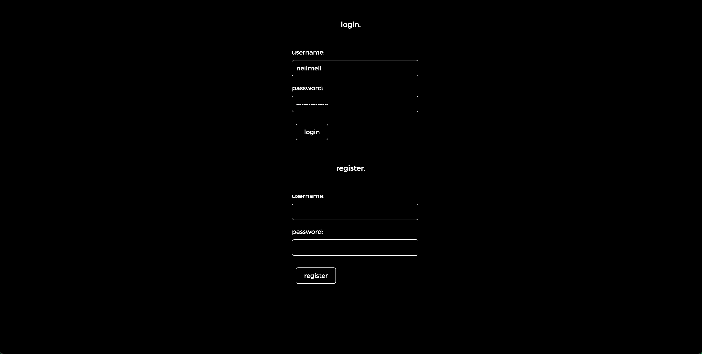

## groovi

This is a web application built to help people begin, develop and track healthy habits. Think of it like a weekly planner but made specifically for healthy habits you want to experiment with. Submit Habits and they will appear on your homepage, giving you a convenient overview of your current habits. Groovi is meant to encourage users to be consistent and committed in the pursuit of their healthy habits. All of that considered, remember that progress is not linear. 

Thank you for viewing my app! Hope you like getting groovi!

## Screenshots

## Technologies Used

- Node.js
- Express
- MongoDB
- Mongoose
- HTML
- CSS
- JavaScript
- EJS
- Git
- GitHub
- Heroku

## Getting Started

1. Access the application via this link:

    https://groovi-8faa9039d858.herokuapp.com/login

2. Create an account.

3. Start submitting habits!

## Next Steps

- Habit Bank
A bank of prepared habits for users to easily add or get inspired by and add their own.

- Progress Tracker
A way to check off a customizable timeframe. Users will be able to check a box to confirm when they successfuly follow a habit for however long.

- Journal
A separate page for Journal entires. Entires can be tagged to easily label the Habit the entry discusses and filter them accordingly.

- Trash Can
A typical feature that will place deleted content in a trash can accessible to users and can be restored if needed. The trash can will also be clearable.

- Dark/Light Mode
A typical toggle switch for dark and light color schemes for the entire site. 

- Mood Tracker
Another page for users to enter how they feel day to day while also picking a color they feel accurately represents their mood. Users will also be able to view every chosen color at once in a tile fromation to give them an aesthetically pleasing and insightful representation of how they've felt so far.

- Habit Display Update
A more calendar/weekplanner-oriented display for the homepage. 7 boxes for each day that'll be autopopulated by the habits based on the users selected days and times. 

- Tutorial Page
A page dedicated to teaching users best practices and the logistics of using the app itself.